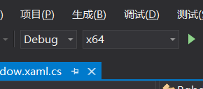

# RgbdForKinect

## 一、准备

Kinect官方文档地址：https://developer.microsoft.com/zh-cn/windows/kinect/

下载&安装驱动：https://www.microsoft.com/en-us/download/details.aspx?id=44561

## 二、获取程序

### 直接下载

请从Release中下载编译好的文件：https://github.com/hljwkwm/RgbdForKinect/releases

### 手动编译

克隆源码：

```
$ git clone https://github.com/hljwkwm/RgbdForKinect.git
```

使用Visual Studio（例如Visual Studio 2019）打开该项目下的`RgbdForKinect.sln`文件，在工具栏中切换为x64，模式使用Debug或者Release均可，如图所示：



然后按F5即可运行程序。

## 三、使用

打开程序后，点击右下角的按钮可以选择路径，或者在右下角的文本框中输入路径，按空格键或者点击左下角的按钮可以保存图片。

